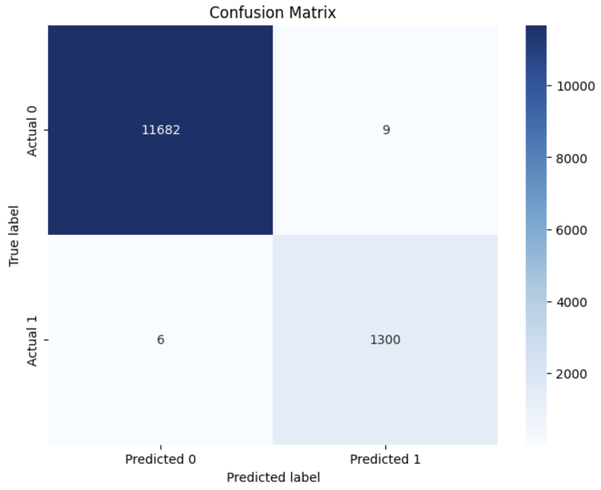

# variable_stars
Machine learning methods in variable stars

# Анализ применения методов машинного обучения для классификации переменных звезд

## Введение

Переменные звезды представляют собой важный класс астрономических объектов, изучение которых позволяет лучше понять эволюцию звезд и структуру галактик. Традиционные методы их идентификации требуют значительных временных и вычислительных ресурсов. В данном исследовании рассматривается возможность применения методов машинного обучения для автоматизации процесса классификации переменных звезд. Были протестированы три модели: логистическая регрессия, метод опорных векторов (SVM) и случайный лес (Random Forest).

## Методы и данные

### Используемые библиотеки
Для реализации проекта были использованы следующие библиотеки Python:
- **Scikit-learn** — для реализации алгоритмов машинного обучения.
- **Pandas** и **NumPy** — для работы с данными и их предварительной обработки.
- **Matplotlib** и **Seaborn** — для визуализации данных и результатов.

### Алгоритмы машинного обучения
В исследовании были применены следующие модели:
1. Логистическая регрессия.
2. Метод опорных векторов (SVM).
3. Случайный лес (Random Forest).

### Описание данных
Исходные данные содержали 64 984 наблюдения с 20 признаками, включая:
- Координаты звезд (`RAJ2000`, `DEJ2000`).
- Фотометрические параметры (`Vmag`, `Bmag`, `gpmag` и др.).
- Параметры переменности (`min_mag`, `max_mag`).
- Целевая переменная (`type`) — бинарный признак, указывающий на принадлежность к переменным звездам.

### Предварительная обработка данных
- Удалены неинформативные признаки (координаты, минимальная и максимальная звездная величина).
- Пропущенные значения заполнены медианными значениями.
- Применено стандартное масштабирование признаков.
- Данные разделены на обучающую и тестовую выборки в соотношении 80/20.

## Результаты

### Производительность моделей

#### Логистическая регрессия
- **Accuracy**: 0.999  
- **Precision**: 0.992  
- **Recall**: 1.000  
- **F1-Score**: 0.996  
-  

#### Метод опорных векторов (SVM)
- **Accuracy**: 0.999  
- **Precision**: 0.992  
- **Recall**: 0.997  
- **F1-Score**: 0.994  
-    

#### Случайный лес (Random Forest)
- **Accuracy**: 0.999  
- **Precision**: 0.993  
- **Recall**: 0.998  
- **F1-Score**: 0.996  
-    

### Градиентный бустинг
- **Accuracy**: 0.999  
- **Precision**: 0.993  
- **Recall**: 0.996
- **F1-Score**: 0.995  
-   